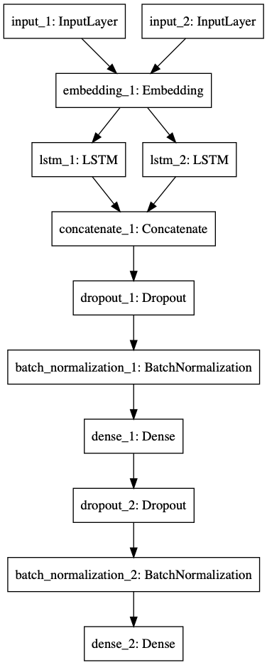

# 基于LSTM的语句相似度匹配
一个简单的基于LSTM的语句相似度匹配，忽略掉前期额EDA过程，整个流程主要是：词向量训练，数据预处理向量化，lstm模型的训练。
# 网络结构

# 输入
数据格式：序号 q1 q2 标签，分隔符为`\t`
```
0	怎么更改花呗手机号码	我的花呗是以前的手机号码，怎么更改成现在的支付宝的号码手机号	1
1	也开不了花呗，就这样了？完事了	真的嘛？就是花呗付款	0
2	花呗冻结以后还能开通吗	我的条件可以开通花呗借款吗	0
3	如何得知关闭借呗	想永久关闭借呗	0
4	花呗扫码付钱	二维码扫描可以用花呗吗	0
5	花呗逾期后不能分期吗	我这个 逾期后还完了 最低还款 后 能分期吗	0
6	花呗分期清空	花呗分期查询	0
7	借呗逾期短信通知	如何购买花呗短信通知	0
8	借呗即将到期要还的账单还能分期吗	借呗要分期还，是吗	0
9	花呗为什么不能支付手机交易	花呗透支了为什么不可以继续用了	0
```
# 结果
准确率：0.82375

# 相关比赛
[https://blog.csdn.net/u014732537/article/details/81038260](https://blog.csdn.net/u014732537/article/details/81038260)
[https://www.kaggle.com/c/quora-question-pairs](https://www.kaggle.com/c/quora-question-pairs/kernels)

